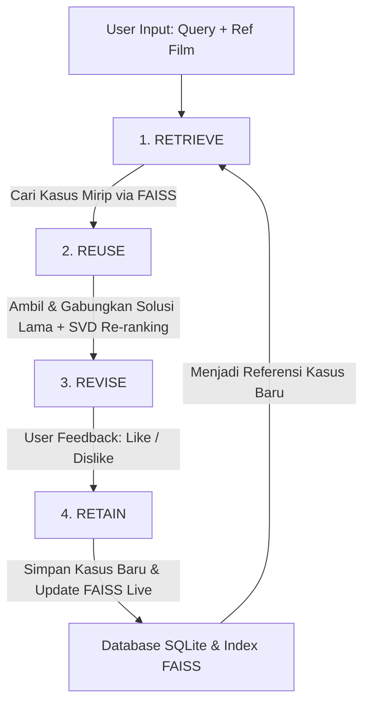
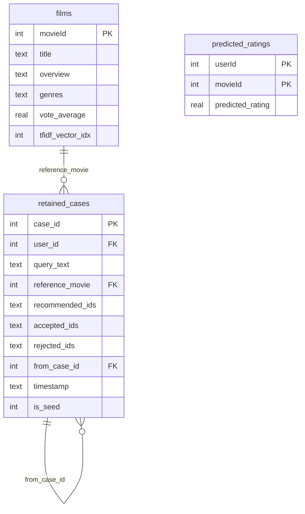

# Dokumentasi Desain & Perancangan Sistem: CineCBR

Dokumentasi ini menjelaskan arsitektur, paradigma, struktur data, dan detail implementasi teknis dari **CineCBR**, sebuah Sistem Rekomendasi Film Hybrid berbasis **Case-Based Reasoning (CBR)** yang dikombinasikan dengan **Content-Based Filtering (CBF)** dan **Collaborative Filtering (CF)**.

---

## 1. Paradigma Utama: Case-Based Reasoning (CBR)

Berbeda dengan sistem rekomendasi tradisional yang memetakan preferensi pengguna langsung ke item (film), CineCBR memodelkan rekomendasi sebagai pemecahan masalah berbasis **kasus masa lalu (kasus interaksi)**.

Dalam konteks CineCBR:
*   **Kasus (Case)**: Representasi dari satu sesi interaksi pengguna.
*   **Masalah (Problem)**: Teks pencarian (query) dan/atau film referensi yang dimasukkan oleh pengguna saat ini.
*   **Solusi (Solution)**: Kumpulan film yang disukai (like/accept) oleh pengguna pada sesi tersebut.

Sistem bekerja berdasarkan prinsip bahwa **masalah yang mirip memiliki solusi yang mirip**. CineCBR mengimplementasikan siklus **4R CBR** secara penuh:



---

## 2. Arsitektur Sistem Hybrid

CineCBR menggabungkan tiga teknik filter untuk menghasilkan rekomendasi yang akurat, personal, dan tahan terhadap masalah *cold-start*:

1.  **CBR (Retrieve & Reuse)**: Mengambil solusi sukses dari kasus-kasus pengguna lain yang memiliki pola pencarian serupa.
2.  **Content-Based Filtering (CBF)**: Menggunakan representasi **TF-IDF** pada sinopsis dan genre film untuk menghitung kemiripan kosinus. Digunakan sebagai:
    *   Pengukur kemiripan kueri/film referensi pada tahap *Retrieve*.
    *   *Fallback* langsung apabila basis kasus (case base) masih kosong atau tidak ada kasus yang memenuhi ambang batas kemiripan (*similarity threshold*).
3.  **Collaborative Filtering (CF)**: Menggunakan model **SVD (Singular Value Decomposition)** yang dilatih dengan pustaka *Surprise* pada data rating historis pengguna. Digunakan di tahap *Reuse* untuk mempersonalisasi skor rekomendasi berdasarkan kecocokan personal pengguna saat ini.

### Alur Kombinasi Skor (Tahap Reuse)

Skor akhir dari suatu film kandidat $f$ dihitung menggunakan formula pembobotan gabungan:

$$\text{Score}_{\text{akhir}}(f) = \left( w_c \cdot \text{Score}_{\text{CBR}}(f) + w_f \cdot \text{Score}_{\text{CF}}(f) + w_g \cdot \text{Score}_{\text{Genre}}(f) \right) \cdot \text{NoveltyPenalty}(f)$$

*   **$Score_{CBR}$**: Skor akumulasi berdasarkan kemiripan kasus-kasus yang memuat film tersebut.
*   **$Score_{CF}$**: Prediksi rating dari model SVD untuk pengguna aktif (skala $0.5 - 5.0$ dinormalisasi ke $[0, 1]$). Jika pengguna baru (*cold start*), bobot CF diset ke $0$.
*   **$Score_{Genre}$**: Penyesuaian berbasis kecocokan genre film kandidat dengan pola genre yang disukai pada kasus-kasus serupa yang ditemukan.
*   **Novelty Penalty**: Pengurangan skor sebesar 85% untuk film yang pernah di-like sebelumnya oleh user bersangkutan agar menghindari lingkaran rekomendasi berulang (*feedback loop*).

---

## 3. Desain Basis Data (Database Schema)

CineCBR menggunakan basis data relasional **SQLite** (`models/cases.db`) yang dikombinasikan dengan file indeks vektor cepat **FAISS** untuk pencarian kedekatan spasial berdimensi tinggi.



### Detail Tabel Utama

1.  **`films`**: Menyimpan katalog lengkap film yang digunakan untuk pencarian teks alternatif dan pemetaan visual di Web UI.
2.  **`retained_cases`**: Inti dari basis pengetahuan CBR. Menyimpan data representasi sesi interaksi, termasuk daftar ID film yang direkomendasikan, disukai (accepted), dan ditolak (rejected). Kolom `is_seed` bernilai `1` untuk data simulasi awal dan `0` untuk kasus nyata hasil input pengguna.
3.  **`predicted_ratings`**: Caching skor prediksi kolaboratif untuk mempercepat respons re-ranking di backend.

---

## 4. Siklus Hidup Data (Lifecycle & Pipeline)

Sistem ini terbagi menjadi dua fase operasional: **Fase Setup & Training Offline** dan **Fase Interaksi Online (Real-time)**.

### A. Fase Setup & Training (Offline)

```
[Preprocessing CSV] ──► [build_casebase.py] ──► [train_cbf.py] ──► [train_cf.py]
    Pembersihan           Inisialisasi SQLite     Melatih TF-IDF &   Melatih model SVD
    dataset awal          & 3.278 Seed Cases      Indeks FAISS       & Caching Prediksi
```

1.  **`build_casebase.py`**: Membuat database SQLite, mengisi tabel `films`, dan mengekstrak data historis pengguna dengan rating tinggi ($\ge 4.0$) untuk dijadikan **3.278 Seed Cases** awal agar sistem tidak mengalami *cold-start* secara sistemik.
2.  **`train_cbf.py`**: Melatih model **TF-IDF Vectorizer** dengan kosakata maksimal 5.000 fitur. Membangun indeks FAISS untuk film (`movie_index.faiss`) dan kasus (`case_index.faiss`).
3.  **`train_cf.py`**: Melatih model kolaboratif **SVD** menggunakan data rating historis (96.941 rating dari 671 user) untuk memprediksi kecocokan film bagi user yang aktif.

### B. Fase Interaksi Online & Dinamis (Real-time)

Fase ini berjalan ketika Flask Web Server (`app.py`) aktif dan berinteraksi dengan pengguna di Web UI:

```
[User Input] ──► [recommend.py] ──► [CBR Retrieve & Reuse] ──► [Web UI Render]
                       ▲                                              │
                       │                                              ▼
                [Update FAISS & DB] ◄── [app.py /api/feedback] ◄── [Revise (Like/Dislike)]
```

*   **Pencarian Kasus Dinamis**: Input pencarian dikonversi menjadi vektor TF-IDF secara instan menggunakan model yang telah dimuat, kemudian dicari kedekatan kosinusnya pada indeks FAISS aktif.
*   **Penyimpanan & Pembelajaran Langsung (Dynamic Retain)**: Ketika user memberikan *feedback* (Like/Dislike) dan menekan tombol **"Simpan ke Case Base"**, kasus baru tersebut langsung dimasukkan ke tabel `retained_cases` di SQLite. Vektor representasi kasus baru tersebut dihitung dan **langsung disisipkan ke indeks FAISS aktif (`case_index.faiss`) secara real-time** menggunakan perintah `.add()` tanpa memerlukan re-training ulang dari awal.

---

## 5. Struktur Komponen Kode

*   **`app.py`**: Berperan sebagai pengontrol aplikasi web (Flask Server). Menyediakan API endpoint untuk kalkulasi rekomendasi (`/api/recommend`), pemrosesan umpan balik revisi (`/api/feedback`), dan data statistik dasbor (`/api/stats`).
*   **`recommend.py`**: Berisi kelas inti `CBRRecommender`. Mengatur logika pemrosesan siklus CBR, perhitungan formula similarity, re-ranking berbasis SVD CF, penalti novelty, serta logika pencarian fallback literal.
*   **`templates/index.html`**: Antarmuka pengguna (Frontend) interaktif dengan tema gelap premium berbasis CSS Vanilla dan Javascript. Menggunakan AJAX untuk komunikasi API asinkronus dan mengintegrasikan **TMDB API** eksternal untuk pemuatan poster film serta tahun rilis secara dinamis.
*   **`evaluate.py`**: Menjalankan evaluasi akurasi sistem secara offline menggunakan metrik temu-balik informasi (*Information Retrieval*):
    *   **Precision@5**: Mengukur ketepatan film yang direkomendasikan pada peringkat 5 teratas.
    *   **Recall@5**: Mengukur kemampuan sistem mengambil kembali film yang disukai dari histori.
    *   **NDCG@5 (Normalized Discounted Cumulative Gain)**: Mengukur kualitas urutan ranking rekomendasi (film paling relevan harus berada di posisi teratas).
